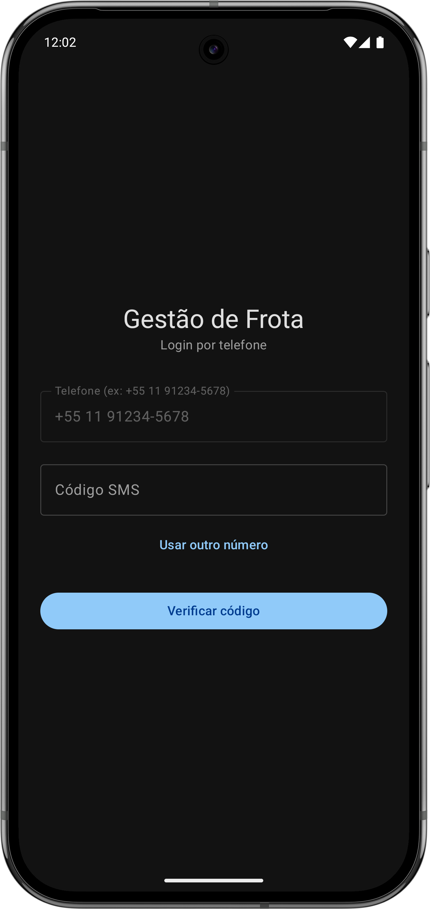
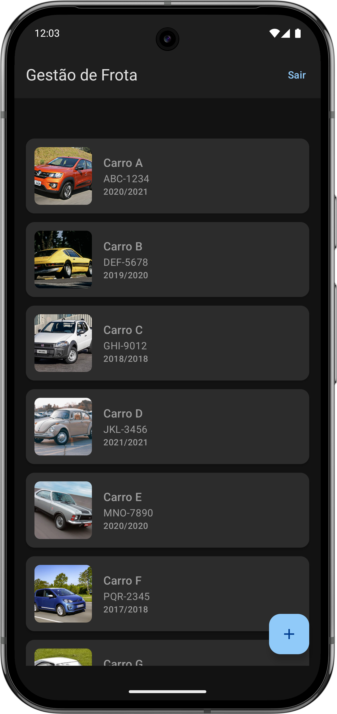
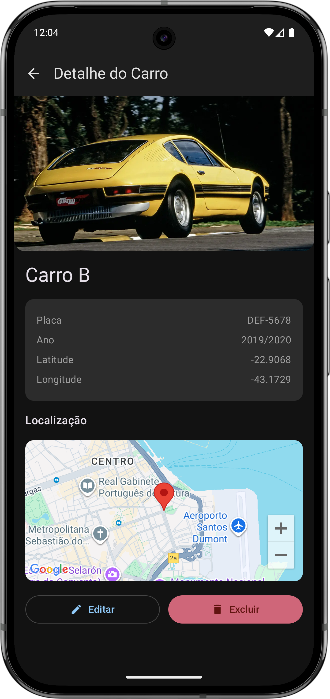
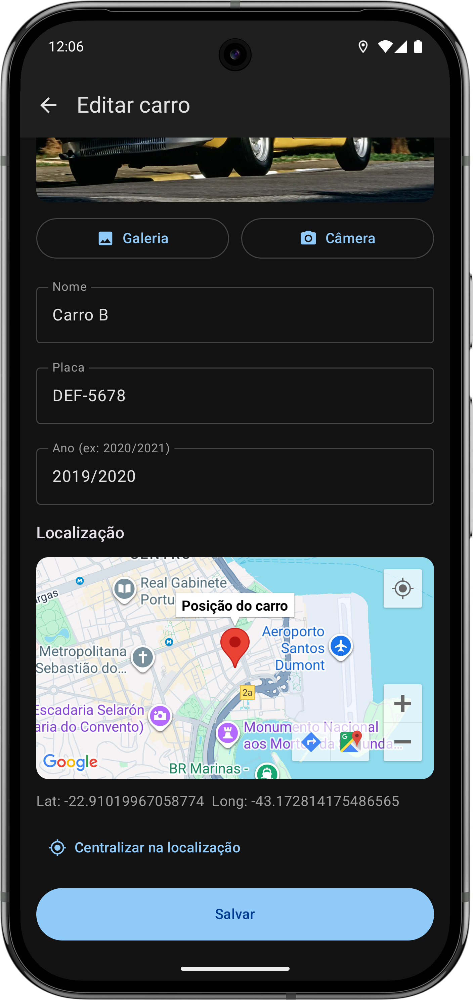
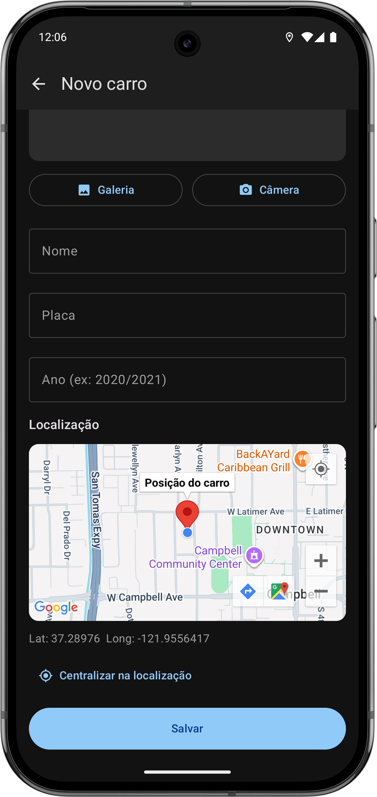

# Gestão de Frota


> Aplicativo Android para gerenciamento de frota de veículos, com autenticação Firebase, consumo de API REST, upload de imagens para o Firebase Storage e visualização de localização no Google Maps.

---

## Contexto acadêmico

Este projeto foi desenvolvido como trabalho de pós-graduação na disciplina **APIs de Integração para Dispositivos Móveis**. O objetivo é consolidar o aprendizado prático sobre:

- **Autenticação Firebase** — login por telefone com verificação SMS
- **APIs REST** — consumo de endpoints com Retrofit
- **Integração com serviços Google** — Firebase (Auth, Storage) e Google Maps
- **Arquitetura MVVM** — separação entre View, ViewModel e Repository
- **Jetpack Compose** — interface declarativa com Material Design 3
- **Coroutines** — operações assíncronas sem bloqueio da UI
- **Navigation Compose** — navegação com transições (Shared Axis, Fade Through)

---

## Screenshots

<p align="center">
  
  
  
</p>

<p align="center">
  
  
</p>

---

## Tecnologias utilizadas

| Tecnologia | Documentação |
|------------|--------------|
| Kotlin | [kotlinlang.org](https://kotlinlang.org) |
| Jetpack Compose | [developer.android.com/jetpack/compose](https://developer.android.com/jetpack/compose) |
| Material Design 3 | [m3.material.io](https://m3.material.io) |
| Firebase Auth | [firebase.google.com/docs/auth](https://firebase.google.com/docs/auth) |
| Firebase Storage | [firebase.google.com/docs/storage](https://firebase.google.com/docs/storage) |
| Retrofit | [square.github.io/retrofit](https://square.github.io/retrofit) |
| Gson | [github.com/google/gson](https://github.com/google/gson) |
| Coil | [coil-kt.github.io/coil](https://coil-kt.github.io/coil) |
| Google Maps SDK | [developers.google.com/maps](https://developers.google.com/maps/documentation/android-sdk) |
| Maps Compose | [googlemaps.github.io/maps-compose](https://googlemaps.github.io/maps-compose) |
| Navigation Compose | [developer.android.com/jetpack/compose/navigation](https://developer.android.com/jetpack/compose/navigation) |
| Coroutines | [kotlinlang.org/docs/coroutines-overview](https://kotlinlang.org/docs/coroutines-overview.html) |
| OkHttp Logging | [square.github.io/okhttp](https://square.github.io/okhttp) |

---

## Funcionalidades

- **Login por telefone** — autenticação via Firebase (número de teste: `+55 11 91234-5678`, código: `123456`)
- **Listagem de carros** — consumo do endpoint `GET /car` com pull-to-refresh e shimmer
- **Cadastro de carros** — formulário com upload de imagem para Firebase Storage e envio via `POST /car`
- **Detalhe do carro** — exibição completa dos dados e localização no mapa (Google Maps)
- **Edição de carros** — alteração de dados via `PATCH /car/:id`
- **Exclusão de carros** — remoção via `DELETE /car/:id` com snackbar de desfazer
- **Logout** — saída da conta com redirecionamento para a tela de login
- **Tema** — dark theme por padrão, suporte a tema claro conforme configuração do sistema
- **Navegação** — transições Shared Axis (lista ↔ detalhe) e Fade Through (lista ↔ formulário)

---

## Como executar

### Pré-requisitos

- Android Studio Hedgehog (2023.1.1) ou superior
- JDK 11
- Emulador Android ou dispositivo físico (API 26+)
- Node.js 14+ (para rodar a API de carros localmente)

### Passo a passo

1. **Clone o repositório**

   ```bash
   git clone <url-do-repositorio>
   cd GestaoFrotaApp
   ```

2. **Configure as chaves e variáveis** (veja seção [Configuração de API Keys](#configuração-de-api-keys))

3. **Sincronize o Gradle** — `File > Sync Project with Gradle Files`

4. **Execute o app** — `Run` (Shift+F10) ou botão de play na toolbar

5. **(Opcional) Suba a API de carros** — se estiver usando a API local:

   ```bash
   git clone https://github.com/vagnnermartins/FTPR-Car-Api-Node-Express.git
   cd FTPR-Car-Api-Node-Express
   npm install
   node index.js
   ```

   O servidor ficará disponível em `http://localhost:3000`.

---

## Configuração de API Keys

As chaves e URLs sensíveis **não** devem ser commitadas. Use o arquivo `local.properties` na raiz do projeto (já ignorado pelo Git).

### 1. Crie ou edite `local.properties`

```properties
# Chave do Google Maps (obrigatório para mapas)
MAPS_API_KEY=sua_chave_google_maps

# URL base da API de carros
# Emulador: use 10.0.2.2 (equivale ao localhost da máquina)
# Dispositivo físico: use o IP da sua máquina na rede (ex: 192.168.X.X)
# Se optar pelo dispositivo físico, certifique-se de que o IP foi adicionado em /app/src/main/res/xml/network_security_config.xml
API_BASE_URL=http://10.0.2.2:3000/
```

### 2. Google Maps

1. Acesse o [Google Cloud Console](https://console.cloud.google.com/)
2. Ative a **Maps SDK for Android**
3. Crie uma chave restrita a Android (package `com.utfpr.gestaofrotaapp` e SHA-1 do keystore)
4. Cole em `MAPS_API_KEY`

### 3. Firebase

1. No [Firebase Console](https://console.firebase.google.com/), crie ou abra o projeto
2. Registre o app Android com o package `com.utfpr.gestaofrotaapp`
3. Baixe o arquivo **google-services.json** e coloque em `app/google-services.json`
4. Em **Authentication** > Sign-in method, habilite **Phone** e configure o número de teste `+55 11 91234-5678` com código `123456`
5. Em **Storage**, ative o Storage do projeto

---

## Referências

- [Documentação Android](https://developer.android.com/docs)
- [Jetpack Compose](https://developer.android.com/jetpack/compose)
- [Firebase para Android](https://firebase.google.com/docs/android/setup)
- [Material Design 3](https://m3.material.io)
- [API de Carros — Node.js/Express](https://github.com/vagnnermartins/FTPR-Car-Api-Node-Express) — backend consumido pelo app

---

## Autor

**Nome:** Henrick Santiago

**Instituição:** UTFPR

- LinkedIn: [linkedin.com/in/hsantiago-dev](https://www.linkedin.com/in/hsantiago-dev/)
- GitHub: [@hsantiago-dev](https://github.com/hsantiago-dev)
